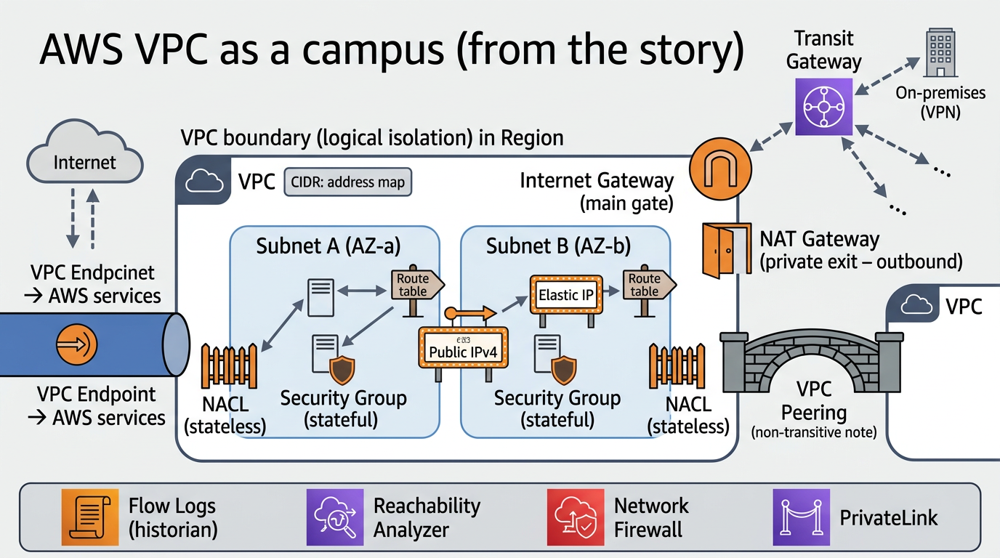

# VPC core concepts — the same cast, told as a story

## User query

> read … `03_aws-vpc-core-concepts.md` and write the role of each concept as if it was a story

### User query (routing update)

> update … `04_vpc-core-concepts-story.md` and tell the story of how inbound and outbound packets are routed in and out of the VPC

## The story

Imagine you are building a **private campus** in the cloud: not a single machine, but a whole estate where applications live, talk to each other, and sometimes need to reach the outside world—or stay deliberately hidden.

### Act I — The land and the lots

First you draw the boundary: that is your **VPC**, your **logically isolated** plot of land inside a **Region**. You decide how addressing works across the whole estate using a **CIDR block**—the master map of which IP “addresses” belong to you, so nothing outside confuses your mail with someone else’s.

You subdivide the land into **subnets**: each lot is a **slice** of that address map, and critically each subnet lives in **exactly one Availability Zone**, like a neighborhood that sits on one side of the fault line. If you want resilience when lightning strikes one neighborhood, you repeat the pattern in other **AZs**—same kind of subnet, different **AZ**.

### Act II — Signs at every corner

Packets do not wander by instinct—they follow **route tables**. Each table is a collection of **signposts**: “to reach this destination CIDR, go this way.” At work are routes for **local** traffic inside the campus, and for traffic that must leave via an **Internet Gateway**, a **NAT Gateway**, a **peering** link, a **Transit Gateway**, a **VPN** (through **virtual private** and **customer** gateways), or toward **AWS itself** via **VPC endpoints**. Without the right sign, two friendly servers in peer networks never meet; with the wrong sign, traffic takes a dangerous detour.

The **Internet Gateway** is the campus **main gate** to the **public internet**—bidirectional for resources that are meant to be reachable and to reach the world. **NAT Gateway** (or the older **NAT instance**) is the **private exit door**: residents in **private** subnets can **go out** to fetch updates or call external APIs, but strangers on the internet cannot **start** a conversation inward through that door. For IPv6, the **egress-only internet gateway** plays a similar “we may leave, you may not simply walk in” role for outbound-only public paths.

**VPC endpoints**—**gateway** or **interface**—are **private service corridors** straight into AWS APIs (S3, DynamoDB, and many others), so your traffic need not ride the public internet just to talk to another AWS service.

**VPC peering** is a **private bridge** between two campuses (two VPCs). Only those two are joined; **peering is not transitive**—there is no “friend of a friend” shortcut—and **overlapping CIDRs** are like two houses claiming the same street number: the post office refuses to deliver.

**Transit Gateway** is the **grand central station**: not inside one VPC’s fence, but the hub that lets **many** VPCs—and often **on-premises** networks—trade traffic under one routing model, when pairwise peering would become a tangle.

### Act III — Names and whispers

When workloads need names, not just numbers, **Route 53 Resolver** and DNS behavior in the VPC matter—especially if you’re stitching **hybrid** DNS with a corporate network. Older **DHCP option sets** are like the campus bulletin that once said “here is your domain suffix and where to ask for names,” though many estates today lean on **Amazon-provided DNS**. **VPC attributes** such as **DNS support** and **DNS hostnames** decide whether the cloud will hand out **sensible public DNS names** for instances and help private resolution behave as operators expect.

### Act IV — Bouncers and door frames

Every workload wears a **network interface**—an **ENI**—the **virtual NIC** where **private IPs** (and sometimes **secondary** private IPs) actually **attach**. **Security groups** are the **stateful bouncers** at each ENI’s door: they remember who you talked to and allow return traffic; they work on **allow** lists with an **implicit deny**. **Network ACLs** are the **stateless gates** at the **subnet** boundary—coarse, order‑matters rules that can **deny** or allow **before** traffic even reaches the bouncer. You might use both: NACL for broad policy, security groups for fine, instance‑aware policy.

When something must stay reachable at a **fixed public address**, **Elastic IP** is the **reserved marquee** you bolt onto an ENI **or** a NAT Gateway—static **public IPv4** in a world where defaults are ephemeral.

Whether a subnet is considered **public** or **private** is not a label on the deed alone—it is a **story of routes**: a **public** pattern usually sends **`0.0.0.0/0` toward the IGW** (and instances may get **public IPs** by design); a **private** pattern **avoids** sending instance traffic through the IGW for internet access and instead sends **`0.0.0.0/0` toward a NAT Gateway** when it needs outbound-only internet.

### Act IV½ — The couriers: how packets leave and come back

Think of each packet as a **courier** carrying a letter with a **to** and **from** address. The **VPC router** and **route tables** decide which **gate or lane** the courier takes next; **security groups** and **NACLs** decide whether the courier is allowed to knock on a given **ENI** or cross a **subnet** border. Here is how the drama plays out for the internet edge—the pattern most people mean when they say “in and out of the VPC.”

**Eastbound parcels—traffic that originated *inside* the VPC**

1. **A local chat** — If the destination IP falls inside your **VPC CIDR**, the route table’s **`local`** rule keeps the courier **inside the fence**. No internet gateway is involved; the campus mail room delivers to the right subnet and ENI. **Peering**, **Transit Gateway**, or **VPN** paths are similar stories: the signpost says “for *that* distant CIDR, use *this* attachment,” and the packet never needs the public **IGW** unless your design sends it there by mistake.

2. **A walk to a vendor (AWS APIs) without crossing the public square** — If you pointed **prefix lists** or routes at a **VPC endpoint** (gateway or interface), couriers bound for S3, DynamoDB, or many other AWS APIs use the **private corridor** straight to the service. The **IGW** never sees them.

3. **Leaving through the main gate (public subnets)** — A workload in a **public** subnet often has a **public IPv4** (ephemeral or **Elastic IP**) on its ENI in addition to its **private** IP. When it sends to something on the **public internet**, the subnet’s **default route** sends **`0.0.0.0/0`** traffic to the **Internet Gateway**. The **IGW** does the edge NAT-like magic between **VPC addresses** and **public addresses** so replies can find their way back. The **security group** on the ENI must **allow** the outbound flow you care about (and because it is **stateful**, the **return traffic** is permitted when the conversation was opened from inside—subject to your rules). **NACLs** must allow the subnet leg in both directions if you use them strictly.

4. **Slipping out the staff exit (private subnets)** — Instances here usually have **only private IPs**. Their **`0.0.0.0/0`** route aims at a **NAT Gateway** (or NAT instance), **not** the IGW. The courier stops at the NAT; the NAT rewrites the **source** so the internet sees the NAT’s **public** identity (its **Elastic IP**). The reply hits the **IGW**, returns to the **NAT**, and the NAT untangles the mapping and forwards back to the **private** instance. That is why **NAT is outbound‑friendly** but **not a front door for strangers**: the internet cannot **initiate** a session to your private IP through the NAT the way it can to a public address on the IGW path.

**Westbound couriers—traffic that originated *outside* and wants *in***

1. **Knocking on a public address** — A client on the internet aims at your instance’s **Elastic IP** or **public** address. The packet hits the **Internet Gateway**, which knows which **VPC** owns that public face, then **VPC routing** steers it toward the correct **subnet** and **ENI**. The **security group** must explicitly **allow** that **inbound** (e.g. `tcp/443` from the right sources); otherwise the bouncer turns the courier away. **NACLs** are evaluated first at the subnet edge—both **inbound** and **return** rules must make sense because they are **stateless** unless you mirror them carefully.

2. **No welcome mat on the private door** — If an instance has **no public IP** and sits behind **only** a **NAT Gateway** for outbound internet, **random visitors on the internet cannot address it directly**—there is **no** DNAT path through standard NAT GW for “please land on this private host.” In the story, you either put a **public face** in a **public** subnet (bastion, load balancer, reverse proxy), **tunnel** in over **VPN** or **Direct Connect**, or invite traffic through **PrivateLink** or **peering**—each with its own **route table** story.

3. **Through the drawbridge (load balancer)** — Often the **Elastic IP** or public listener lives on an **Application Load Balancer** or **Network Load Balancer** in public subnets; the balancer’s **private** legs fan out to targets in **private** subnets. Inbound internet traffic meets the **IGW**, then the **LB**, then **private** routing to targets—**security groups** on both the LB and the targets must cooperate.

**The moral for exams and designs**

**Outbound** internet access from **private** subnets is almost always **NAT → IGW** in the telling; from **public** subnets it is often **direct IGW** when the ENI has a **public** address. **Inbound** internet access needs a **routable public destination** somewhere in your design or an **alternate entry** (LB, VPN, PrivateLink, etc.). **Security groups** remember **connections**; **NACLs** do **not**. If something “should work” but does not, the **historian** (Flow Logs) and the **detective** (Reachability Analyzer) reenact the courier’s route — **subnet association**, **route precedence**, **IGW/NAT attachment**, and **both** halves of stateless ACLs are the usual plot twists.

### Act V — Remembering and debugging

**VPC Flow Logs** are the **historian**: a record of what tried to pass which interfaces—gold for **audit** and **forensics**. **Reachability Analyzer** is the **path detective**: it walks the model of routes, security, and attachments to say “here is why this packet cannot arrive,” without guessing.

### Act VI — Guests and heavy armor

**PrivateLink**—via **interface VPC endpoints** to another party’s **endpoint service** backed by a **Network Load Balancer**—is the **dedicated VIP tunnel** into **someone else’s** service (even another account’s VPC) without collapsing your address plans together.

**AWS Network Firewall** is the **inspected checkpoint** you thread traffic through when you need a **managed**, **central** policy appliance beyond what route tables and security groups alone express.

---

### Diagram (image)

Source file in this folder: `04_vpc-core-concepts-story-diagram.png` (AI-generated infographic from this narrative).

### Related

- Factual checklist and definitions: `03_aws-vpc-core-concepts.md`
- CIDR math and sizing: `02_cidr-blocks-aws.md`
- Peering procedure: `01_vpc-peering-setup.md`
- Study question bank (full coverage of this story): `06_vpc-story-study-questions.md`
