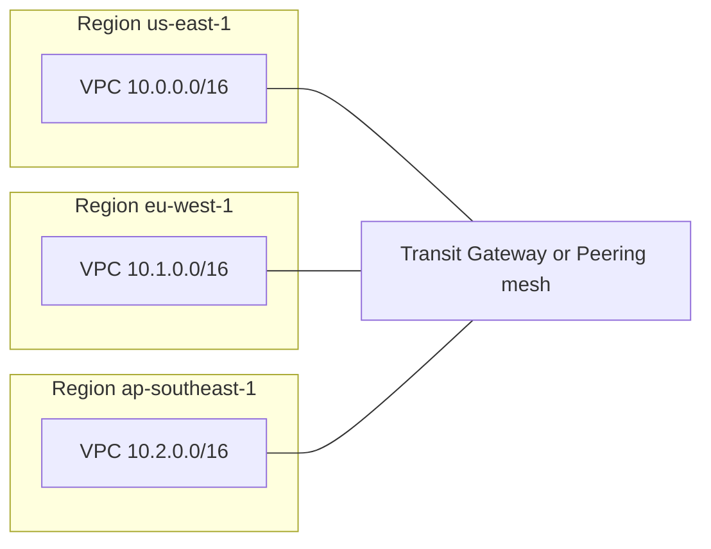

# Multi-region VPC design with subnets, AZs, and CIDR planning

## User query

Give me a complete VPC design with multiple subnets and across multiple regions and AZs. Show CIDR block design.

## Notes / answer

### Core AWS fact (exam-relevant)

A **VPC is always regional**. One VPC does **not** span multiple AWS Regions. A “multi-region VPC design” means **one VPC per Region** (or more than one per Region if you split workloads), with **non-overlapping CIDRs** and **connectivity** between Regions (for example **AWS Transit Gateway**, **VPC peering**, **PrivateLink**, or **VPN / Direct Connect** to a central hub).

---

### Design goals

| Goal | How CIDR planning helps |
|------|-------------------------|
| No overlap for peering / TGW / VPN | Each Region (and often each account) gets a distinct summary block |
| Room to grow | Use a **summary** block per Region (often `/16`) and subnet **allocations** inside it |
| HA across AZs | **Duplicate subnet tiers per AZ** (public, private app, private data) |
| Operational clarity | **Predictable octets** (e.g. third octet = AZ slice, fourth = tier) |

---

### Addressing plan (example: three Regions)

Use **RFC 1918** space. A common pattern is **one `/16` per Region** from `10.0.0.0/8`:

| Region | VPC IPv4 CIDR | Role |
|--------|----------------|------|
| `us-east-1` | `10.0.0.0/16` | Primary workload |
| `eu-west-1` | `10.1.0.0/16` | DR / EU users |
| `ap-southeast-1` | `10.2.0.0/16` | APAC |

**Rules of thumb**

- **Do not overlap** these blocks with on-premises networks, partner networks, or other VPCs you will peer to.
- If a single `/16` is too small long-term, plan **secondary CIDR blocks** on the same VPC (same Region) or add **another VPC** in that Region and peer/TGW attach both—still keep the global plan non-overlapping.

---

### Inside one Region: subnets per AZ (example `us-east-1`, VPC `10.0.0.0/16`)

Assume **3 tiers** and **3 AZs** (adjust counts to match the Region: e.g. 4–6 AZs in large Regions).

**Tier model**

1. **Public** — IGW-facing (ALB, NAT gateway, bastion in some designs).
2. **Private application** — app servers, containers, Lambda with ENIs, internal ALB.
3. **Private data** — RDS, ElastiCache, etc. (often no direct Internet route; egress via NAT in public subnets if needed).

**Subnet sizing**: `/24` per subnet is a common starting point (**251 usable IPv4 addresses** per subnet after AWS reservations). Scale up to `/22` or `/20` if you expect large ASGs or many ENIs.

#### Example allocation (3 AZs × 3 tiers = 9 subnets)

Use **contiguous thirds** of the `/16` so routing and NACLs stay simple.

| Tier | AZ | Subnet CIDR | Example use |
|------|-----|-------------|---------------|
| Public | `us-east-1a` | `10.0.0.0/24` | ALB, NAT GW |
| Public | `us-east-1b` | `10.0.1.0/24` | ALB, NAT GW |
| Public | `us-east-1c` | `10.0.2.0/24` | ALB, NAT GW |
| Private app | `us-east-1a` | `10.0.10.0/24` | ECS/EKS workers, app |
| Private app | `us-east-1b` | `10.0.11.0/24` | ECS/EKS workers, app |
| Private app | `us-east-1c` | `10.0.12.0/24` | ECS/EKS workers, app |
| Private data | `us-east-1a` | `10.0.20.0/24` | RDS subnet group |
| Private data | `us-east-1b` | `10.0.21.0/24` | RDS subnet group |
| Private data | `us-east-1c` | `10.0.22.0/24` | RDS subnet group |

Reserve the rest of `10.0.0.0/16` for:

- Additional AZs (add `10.0.3.0/24`, `10.0.13.0/24`, `10.0.23.0/24`, …).
- **TGW / VPN / Direct Connect** “network” subnets if you use a separate attachment style.
- **Endpoints** (Interface VPC endpoints consume IPs in chosen subnets—plan capacity).

---

### Same pattern in other Regions (non-overlapping)

**`eu-west-1` — VPC `10.1.0.0/16`**

| Tier | AZ | Example CIDR |
|------|-----|----------------|
| Public | `eu-west-1a` | `10.1.0.0/24` |
| Public | `eu-west-1b` | `10.1.1.0/24` |
| Public | `eu-west-1c` | `10.1.2.0/24` |
| Private app | `eu-west-1a`–`c` | `10.1.10.0/24` … `10.1.12.0/24` |
| Private data | `eu-west-1a`–`c` | `10.1.20.0/24` … `10.1.22.0/24` |

**`ap-southeast-1` — VPC `10.2.0.0/16`**

Mirror the same octet pattern under `10.2.x.x`.

This keeps **documentation and automation** symmetric: “third octet `0–2` = public per AZ,” etc.

---

### How Regions connect (conceptual)

- **Transit Gateway (TGW)**: scalable hub; attach each Regional VPC; control routing with TGW route tables (good for many VPCs/Regions).
- **VPC peering**: simple pairwise connection; **no transitive routing** through a peered VPC (each peering is its own relationship); **no overlapping CIDRs** between peered VPCs.
- **PrivateLink**: for exposing specific services across accounts/Regions with private connectivity.

---

### Route tables (per tier, conceptually)

| Subnet type | Default route `0.0.0.0/0` | Notes |
|-------------|---------------------------|--------|
| Public | **Internet Gateway** | Instances need public IP or EIP for inbound from Internet |
| Private app | **NAT Gateway** (in public subnet, per AZ) | Outbound Internet; inbound from Internet usually via ALB in public subnets |
| Private data | Often **no default route** | Only internal + VPC endpoints; or NAT if patches require Internet |

NAT Gateways are **per-AZ** for fault isolation; if an AZ fails, instances in other AZs still use NAT in their AZ.

---

### Secondary CIDR (optional expansion)

If `10.0.0.0/16` fills up, attach for example `10.10.0.0/16` to the **same** VPC and carve new subnets from it—still **must not overlap** any peered or connected network.

---

### IPv6 (dual-stack, optional)

If you use **IPv6**, AWS assigns a **/56** IPv6 CIDR per VPC; subnets get **/64** per subnet. IPv4 design above stays parallel for IPv4-only resources; dual-stack subnets get both an IPv4 and an IPv6 CIDR.

---

### Exam checklist

- VPC = **one Region**; HA = **multiple subnets across multiple AZs** in that Region.
- **Peering / TGW** require **non-overlapping** IPv4 ranges.
- **Subnets** map to **one AZ** each; **route tables** implement tier boundaries (public vs private).
- **NAT** in public subnet; private subnets route `0.0.0.0/0` to **NAT** for controlled egress.

This document is a template: replace Region codes, AZ counts, and `/24` vs `/22` sizing with your workload and IP consumption.

---

### Q: So related AZs don't have matching CIDR blocks, is that correct? and why?

Yes — **that’s correct**, and it’s required by how VPC networking works.

### 1. Same VPC, different AZs: blocks must **not** be identical

A **subnet** is one contiguous IPv4 range inside the VPC CIDR. In a single VPC:

- Each subnet must have a **unique, non-overlapping** CIDR.
- You **cannot** give `us-east-1a` and `us-east-1b` the **same** subnet CIDR (e.g. both `10.0.0.0/24`). That would overlap and is invalid.

So “related” tiers (e.g. all **public** subnets) are related by **role and routing**, not by **sharing one IP range**. They each get their **own** slice of the VPC space: `10.0.0.0/24`, `10.0.1.0/24`, `10.0.2.0/24`, etc.

What *does* match across those AZs is usually:

- The **prefix length** (e.g. all `/24`), and  
- A **predictable pattern** (sequential third octets),

so operations stay simple even though the numbers differ.

### 2. Why they’re different numbers at all

IPs live in **one** subnet. If two AZs used the same range, two instances could get the same IP address in different subnets—**routing within the VPC would be ambiguous**. Unique subnets per AZ also let you:

- Attach **one subnet ↔ one AZ** (a subnet lives in exactly one AZ).
- Send traffic to the **correct** NAT gateway, load balancer ENIs, and network ACL boundaries per AZ.

### 3. Across Regions (if that’s what you meant by “related”)

Each Region has its **own VPC** with its **own** CIDR (e.g. `10.0.0.0/16` vs `10.1.0.0/16`). So the **full** CIDRs will not match between Regions on purpose: **no overlap** for peering, Transit Gateway, VPN, etc.

You *can* mirror the **layout** (e.g. “public tier always uses `x.x.0.0/24`, `x.x.1.0/24`, … in each Region”) while keeping the **VPC prefix** different (`10.0…` vs `10.1…`).

**Short answer:** AZs don’t share one CIDR block because **each subnet needs its own non-overlapping range**; “matching” is about **symmetric design and prefix length**, not the same CIDR string in every AZ.