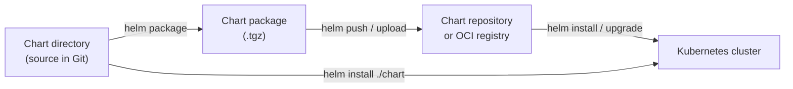
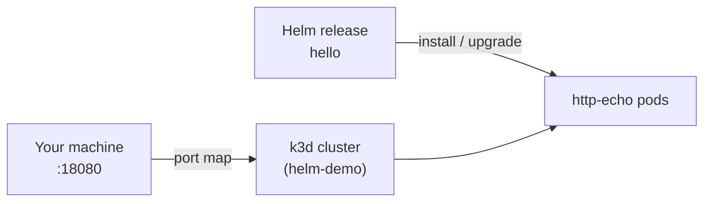

# Helm Charts and Helm Chart Packages

[Helm](https://helm.sh/) is the package manager for Kubernetes. It lets you define, install, upgrade, and roll back applications on a cluster using versioned, reusable configuration instead of hand-written YAML for every environment.

This folder is a reference for two related concepts: the **Helm chart** (the source bundle you author) and the **Helm chart package** (the distributable archive you publish or install).

## Helm Chart

A **Helm chart** is a directory of files that describes a Kubernetes application and how to deploy it. Think of it as a template plus defaults: you define the shape of Deployments, Services, ConfigMaps, and other resources once, then override settings per environment through values.

### What a chart contains

A typical chart layout looks like this:

```
my-app/
├── Chart.yaml          # Chart metadata (name, version, dependencies)
├── values.yaml         # Default configuration values
├── charts/             # Optional subcharts (dependencies)
└── templates/          # Kubernetes manifests as Go templates
    ├── deployment.yaml
    ├── service.yaml
    ├── _helpers.tpl    # Reusable template snippets
    └── NOTES.txt       # Post-install notes shown to the user
```

| File / folder | Purpose |
|---------------|---------|
| `Chart.yaml` | Identifies the chart: name, version, app version, and optional dependency list |
| `values.yaml` | Default inputs (replica count, image tag, resource limits, feature flags) |
| `templates/` | Manifest templates rendered with those values at install/upgrade time |
| `charts/` | Vendored or referenced subcharts for composing larger releases |

Helm renders templates with Go’s `text/template` engine plus Sprig functions and Helm-specific helpers. A value like `replicaCount: 3` in `values.yaml` can become `replicas: 3` in a Deployment manifest. The same chart can target dev, staging, and production by passing different value files or `--set` overrides.

### Common chart workflows

From a chart directory:

```bash
# Validate templates and render manifests locally (no cluster changes)
helm template my-release ./my-app

# Dry-run an install against the cluster API
helm install my-release ./my-app --dry-run

# Install or upgrade on the cluster
helm install my-release ./my-app
helm upgrade my-release ./my-app
```

Charts are the **authoring format**: editable source you keep in Git, review in pull requests, and iterate on over time.

## Helm Chart Package

A **Helm chart package** is a **compressed archive** (`.tgz`) of a chart, produced when you are ready to **distribute** or **install from an artifact** rather than from a live directory.

Packaging bundles the chart directory—including `Chart.yaml`, `values.yaml`, `templates/`, and any packaged subcharts—into a single file named after the chart and its version, for example `my-app-1.2.0.tgz`.

### Creating a package

```bash
helm package ./my-app
# Creates my-app-1.2.0.tgz (version comes from Chart.yaml)
```

The version in `Chart.yaml` drives the filename. Each release you publish should bump that version so consumers can pin upgrades and roll back reliably.

### Installing from a package

```bash
helm install my-release ./my-app-1.2.0.tgz
helm install my-release https://charts.example.com/my-app-1.2.0.tgz
```

You can also add a **chart repository** (an index plus hosted `.tgz` files) and install by name:

```bash
helm repo add my-org https://charts.example.com
helm repo update
helm install my-release my-org/my-app --version 1.2.0
```

Repositories treat chart packages like packages in apt or npm: versioned artifacts with an index (`index.yaml`) that lists available charts and versions.

## Chart vs chart package

| | Helm chart | Helm chart package |
|---|------------|-------------------|
| **Form** | Directory of source files | Single `.tgz` archive |
| **Typical use** | Development, Git, CI rendering | Publishing, registries, reproducible installs |
| **Editable** | Yes — edit templates and values directly | No — unpack or use the source chart to change |
| **Created by** | `helm create`, manual authoring | `helm package` |
| **Version** | Declared in `Chart.yaml` | Encoded in archive name and repo index |

In practice: you **develop** a chart as a folder, **package** it when you want a immutable artifact, and **publish** packages to a chart museum, OCI registry, or static HTTP repo so others (or your pipelines) can install a specific version without cloning your repository.

## How they fit together



Either path works: install from the chart directory during development, or from a packaged version in production for repeatable, version-pinned deployments.

## Related Helm concepts

- **Release** — A named instance of a chart installed on a cluster (e.g. `my-release`). Upgrades and rollbacks operate on releases.
- **Values** — Configuration merged at install time; can come from `values.yaml`, `-f custom.yaml`, or `--set`.
- **Subchart** — A chart depended on by another chart, useful for databases, ingress controllers, or shared components.
- **OCI artifacts** — Modern Helm can push and pull charts as OCI images (`helm push`, `helm pull`), in addition to classic HTTP chart repos.

For official documentation, see the [Helm docs](https://helm.sh/docs/) — especially [Charts](https://helm.sh/docs/topics/charts/) and [Chart Repositories](https://helm.sh/docs/topics/chart_repository/).

---

## Demo: Helm on Kubernetes in Docker

This folder includes a runnable demo: a minimal **hello** chart deployed to a local **k3d** cluster (k3s inside Docker). Scripts download `helm` and `k3d` into `./bin` when they are not already installed.

### Project layout

| Path | Purpose |
|------|---------|
| `chart/hello/` | Minimal Helm chart — deploys `hashicorp/http-echo` with a configurable message |
| `shell/fireup.sh` | Creates a k3d cluster (Kubernetes in Docker) and installs the chart |
| `shell/demo.sh` | Walkthrough: template, upgrade, package, rollback |
| `shell/shutdown.sh` | Removes the release and deletes the cluster |
| `shell/bootstrap.sh` | Downloads `helm` and `k3d` into `./bin` if not already on PATH |
| `packages/` | Chart packages created by `helm package` (gitignored) |
| `bin/` | Project-local `helm` and `k3d` binaries (gitignored) |

### Architecture



1. **k3d** creates a single-node Kubernetes cluster as Docker containers.
2. **Helm** installs the `chart/hello` release (Deployment + LoadBalancer Service).
3. k3d maps **host port 18080** to the cluster load balancer so you can `curl` the app from your browser or terminal.

### Prerequisites

- [Docker](https://docs.docker.com/get-docker/) running (Docker Desktop is fine)

No need to install Helm or k3d separately — the scripts download them into `./bin` on first run if they are not already on your PATH.

### Quick start

From the `HelmChart/` directory (Docker is the only requirement):

```bash
./shell/fireup.sh
curl http://localhost:18080
./shell/demo.sh
./shell/shutdown.sh
```

The app listens on **port 18080** (not 8080) to avoid clashes with other local services such as the Monitoring demo.

| What | Location |
|------|----------|
| App | http://localhost:18080 |
| Chart source | `chart/hello/` |
| Packaged charts (after demo) | `packages/` |

### What the demo shows

1. **k3d** — lightweight Kubernetes running inside Docker
2. **Helm install** — chart deployed from `chart/hello/`
3. **Values** — default message in `values.yaml`, overrides in `values-upgrade.yaml`
4. **Packaging** — `helm package` writes `packages/hello-0.1.0.tgz`
5. **Release lifecycle** — upgrade and rollback via `demo.sh`

| Concept | Where |
|---------|--------|
| Default values | `chart/hello/values.yaml` — message, replica count, image |
| Template rendering | `chart/hello/templates/` — Deployment and Service use `{{ .Values.* }}` |
| Value overrides | `chart/hello/values-upgrade.yaml` — used by `demo.sh` |
| Chart packaging | `helm package` writes `packages/hello-0.1.0.tgz` |
| Release lifecycle | `helm install` → `upgrade` → `rollback` in `demo.sh` |

### Guided walkthrough

After `fireup.sh`, run the step-by-step demo (template, upgrade, package, rollback):

```bash
./shell/demo.sh
```

### Manual commands

All commands assume you are in the `HelmChart/` directory and the cluster is running.

```bash
# Render manifests locally (no cluster)
helm template hello ./chart/hello

# Inspect the live release
helm list
helm get values hello
kubectl get pods,svc

# Upgrade with a different values file
helm upgrade hello ./chart/hello -f ./chart/hello/values-upgrade.yaml

# Create a chart package (.tgz)
mkdir -p packages
helm package ./chart/hello --destination packages

# Roll back
helm history hello
helm rollback hello 1
```

Point `helm` and `kubectl` at the demo cluster:

```bash
export KUBECONFIG="$(k3d kubeconfig write helm-demo)"
```

If you use the project-local binaries:

```bash
export PATH="$(pwd)/bin:$PATH"
```

### Shutdown

```bash
./shell/shutdown.sh
```

This uninstalls the Helm release and deletes the k3d cluster.
