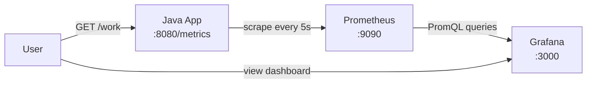

# Java Monitoring Demo

A minimal Java application that exposes Prometheus metrics, scraped by Prometheus and visualised in a pre-provisioned Grafana dashboard. Everything runs in Docker.

## Architecture



1. The **Java app** records counters, timers, and gauges using Micrometer and serves them at `/metrics`.
2. **Prometheus** pulls metrics from the app on a 5-second interval.
3. **Grafana** queries Prometheus and renders the **Java App Metrics** dashboard.

## Quick start

From this directory:

```bash
docker compose up --build
```

Run in the background:

```bash
docker compose up --build -d
```

| Service     | URL                          | Purpose                    |
|-------------|------------------------------|----------------------------|
| Java app    | http://localhost:8080        | App and metrics endpoint   |
| Prometheus  | http://localhost:9090        | Metrics store and UI       |
| Grafana     | http://localhost:3000        | Dashboards                 |

Grafana login: `admin` / `admin`

Open **Dashboards → Monitoring → Java App Metrics** to see live charts. The app also generates sample traffic automatically every 3 seconds, so panels should populate within a few seconds of startup.

## Docker commands

All commands assume you are in the `Monitoring/` directory.

### Start and stop

```bash
# Build images and start all services (foreground, logs in terminal)
docker compose up --build

# Same, but detached (runs in background)
docker compose up --build -d

# Stop containers (keeps images and networks)
docker compose down

# Stop and remove the Compose network
docker compose down --remove-orphans
```

### Status

```bash
# List running services and port mappings
docker compose ps
```

### Viewing logs

#### Docker Compose (recommended)

```bash
# All services — print logs and exit
docker compose logs

# All services — follow live (Ctrl+C to stop)
docker compose logs -f

# One service
docker compose logs app
docker compose logs -f prometheus
docker compose logs -f grafana

# Last N lines only
docker compose logs --tail=50
docker compose logs --tail=100 app

# Logs since a time or date
docker compose logs --since=10m
docker compose logs --since=2026-06-06T10:00:00 app

# Logs until a time
docker compose logs --until=10m

# Timestamps on each line
docker compose logs -f -t app

# Multiple services at once
docker compose logs -f app prometheus
```

#### While starting (foreground)

If you run without `-d`, logs stream in the terminal automatically:

```bash
docker compose up --build
```

#### Raw `docker logs` (by container name)

Find container names first:

```bash
docker compose ps
# or
docker ps --filter "name=monitoring"
```

Then:

```bash
docker logs monitoring-app-1
docker logs -f monitoring-app-1
docker logs --tail=100 monitoring-prometheus-1
docker logs --since=10m monitoring-grafana-1
docker logs -t -f monitoring-app-1
```

#### Quick reference

| Goal | Command |
|------|---------|
| Follow all logs | `docker compose logs -f` |
| Follow one service | `docker compose logs -f app` |
| Last 100 lines | `docker compose logs --tail=100 app` |
| Last 10 minutes | `docker compose logs --since=10m app` |
| With timestamps | `docker compose logs -f -t app` |
| By container name | `docker logs -f monitoring-app-1` |

#### Java app startup output

The app prints endpoint info to stdout on startup (visible in `app` logs):

```text
Monitoring demo running on http://localhost:8080
  /metrics  Prometheus scrape endpoint
  /work     Trigger a sample request
  /health   Health check
```

```bash
docker compose logs app
```

### Rebuild after code changes

```bash
# Rebuild and restart only the Java app
docker compose up --build -d app

# Force a clean rebuild (no cache)
docker compose build --no-cache app
docker compose up -d app
```

### Run individual services

Useful when running the Java app locally with Maven but still wanting Prometheus and Grafana in Docker:

```bash
# Start only Prometheus and Grafana
docker compose up -d prometheus grafana
```

### Shell and debugging

```bash
# Open a shell inside the app container
docker compose exec app sh

# Check Prometheus can reach the app target
curl http://localhost:9090/api/v1/targets

# Hit app endpoints from the host
curl http://localhost:8080/health
curl http://localhost:8080/work
curl http://localhost:8080/metrics
```

### Cleanup

```bash
# Remove stopped containers, unused networks, and dangling images
docker system prune

# Remove everything including unused images (more aggressive)
docker system prune -a
```

## Project layout

```
Monitoring/
├── app/                          # Java application
│   ├── src/main/java/.../App.java
│   ├── pom.xml
│   └── Dockerfile
├── prometheus/
│   └── prometheus.yml            # Scrape config
├── grafana/
│   ├── provisioning/             # Auto-config on startup
│   │   ├── datasources/          # Prometheus connection
│   │   └── dashboards/           # Dashboard loader
│   └── dashboards/
│       └── java-app-metrics.json # Pre-built dashboard
└── docker-compose.yml
```

## Java application

The app is a plain Java 21 program (no Spring Boot). It uses:

- **JDK `HttpServer`** for HTTP endpoints
- **[Micrometer](https://micrometer.io/)** with the Prometheus registry to expose metrics

### Endpoints

| Path       | Description                                      |
|------------|--------------------------------------------------|
| `/metrics` | Prometheus scrape endpoint (text format)         |
| `/work`    | Simulates a request (50–250 ms, ~10% error rate) |
| `/health`  | Returns `200 ok`                                 |

A background scheduler also runs simulated work every 3 seconds so the dashboard shows activity without manual calls.

### Metrics exposed

| Metric                            | Type      | Description                    |
|-----------------------------------|-----------|--------------------------------|
| `app_requests_total`              | Counter   | Successful processed requests  |
| `app_errors_total`                | Counter   | Failed requests                |
| `app_request_duration_seconds`    | Histogram | Request latency                |
| `app_active_tasks`                | Gauge     | In-flight tasks                |

Trigger extra traffic manually (also available via `docker compose` — see **Docker commands** above):

```bash
curl http://localhost:8080/work
curl http://localhost:8080/metrics
```

## Prometheus

Config: `prometheus/prometheus.yml`

Prometheus scrapes the Java container at `app:8080/metrics` every 5 seconds. The hostname `app` is the Docker Compose service name on the shared `monitoring` network.

Useful URLs:

- **Targets**: http://localhost:9090/targets — confirm `java-app` is **UP**
- **Graph**: http://localhost:9090/graph — run PromQL queries directly

Example query:

```promql
rate(app_requests_total[1m])
```

## Grafana

Grafana is provisioned on startup — no manual datasource or dashboard setup required.

- **Datasource** (`grafana/provisioning/datasources/prometheus.yml`): connects to `http://prometheus:9090`
- **Dashboard** (`grafana/dashboards/java-app-metrics.json`): four panels
  - Request rate (`rate(app_requests_total[1m])`)
  - Error rate (`rate(app_errors_total[1m])`)
  - Request duration p50 / p95
  - Active tasks (current gauge value)

## Building locally (without Docker)

Requires Java 21 and Maven:

```bash
cd app
mvn package
java -jar target/monitoring-demo-1.0.0.jar
```

The app listens on port 8080. To use Prometheus and Grafana locally, run only those services from Compose and point Prometheus at `host.docker.internal:8080` instead of `app:8080`:

```bash
docker compose up -d prometheus grafana
```

## How it fits together

```text
  curl /work
       │
       ▼
  ┌─────────────┐     scrape /metrics      ┌─────────────┐
  │  Java App   │ ◄─────────────────────── │ Prometheus  │
  │  Micrometer │                            │  time-series│
  └─────────────┘                            └──────┬──────┘
                                                    │ PromQL
                                                    ▼
                                             ┌─────────────┐
                                             │   Grafana   │
                                             │  dashboard  │
                                             └─────────────┘
```

The Java app owns metric collection. Prometheus owns storage and querying. Grafana owns visualisation. Docker Compose wires the three services onto one network and maps ports to your machine.


### /metrics
```
# HELP app_active_tasks Currently running tasks
# TYPE app_active_tasks gauge
app_active_tasks 0.0
# HELP app_errors_total Total failed requests
# TYPE app_errors_total counter
app_errors_total 35.0
# HELP app_request_duration_seconds Request processing duration
# TYPE app_request_duration_seconds summary
app_request_duration_seconds_count 316
app_request_duration_seconds_sum 48.622744238
# HELP app_request_duration_seconds_max Request processing duration
# TYPE app_request_duration_seconds_max gauge
app_request_duration_seconds_max 0.240028
# HELP app_requests_total Total processed requests
# TYPE app_requests_total counter
app_requests_total{endpoint="work"} 281.0
```
