# Redux

A detailed guide to how Redux works: what problem it solves, the ideas behind it, and how the pieces fit together in a real application.

Redux is a **predictable state container** for JavaScript apps. It is most often used with React, but it is not tied to React — you can use it with Vue, Angular, vanilla JS, or anywhere you need a single, explicit place to hold and update application state.

The official recommendation today is **[Redux Toolkit](https://redux-toolkit.js.org/)** (RTK), which wraps core Redux with less boilerplate and safer defaults. This document explains the underlying model first, then shows how Redux Toolkit applies those ideas in practice.

A small runnable React demo lives in `app/` — see [Demo app](#demo-app) below.

---

## How Redux works (visual overview)

Redux is a loop: the UI **dispatches** an event, a **reducer** computes the next state, the **store** saves it, and the UI **reads** the update. Nothing else may change application state.

### The big picture

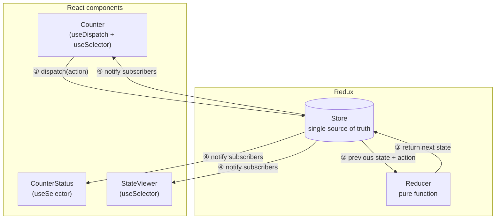

| Step | What happens |
|------|----------------|
| ① | UI reports an event — e.g. `{ type: 'counter/incremented' }` |
| ② | Store passes current state and the action to the reducer |
| ③ | Reducer returns a **new** state object (never mutates the old one) |
| ④ | Store replaces state; components subscribed via `useSelector` re-render |

### One-way data flow

State never flows “back up” through callbacks or direct mutation. Every change follows the same path:

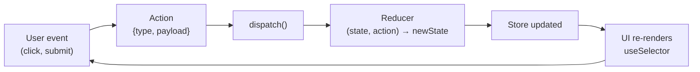

Compare this to ad hoc patterns where child components call `setParentState` or mutate shared objects — Redux forces a single, inspectable pipeline.

### State tree

All slices live in one object inside the store. Components read the slices they need:

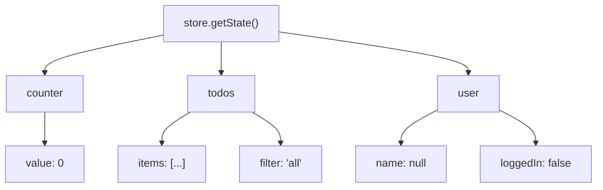

In the demo app, the tree starts as `{ counter: { value: 0 } }`. Every click updates only the `counter` slice.

### The four building blocks

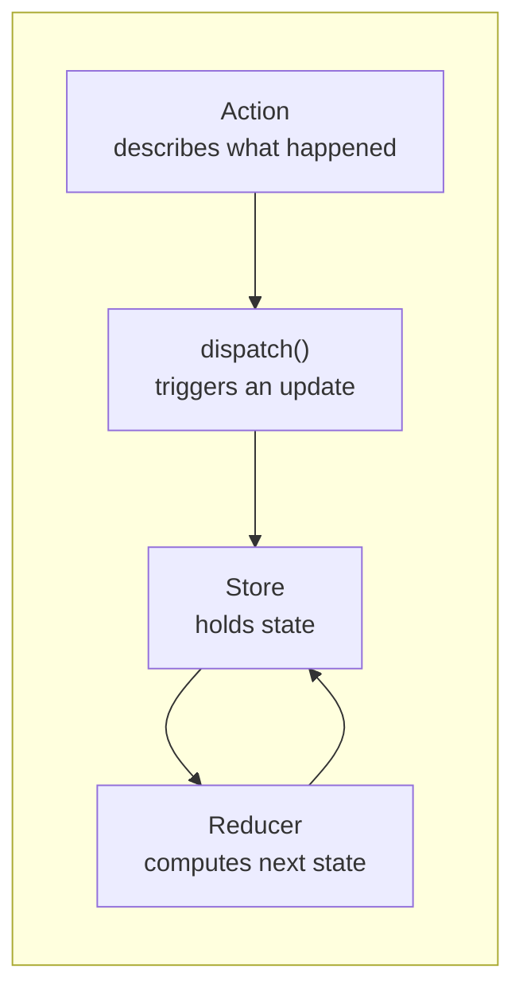

| Block | Analogy | In the demo |
|-------|---------|-------------|
| **Store** | Database of UI facts | `configureStore` in `app/src/store.js` |
| **Action** | Event log entry | `{ type: 'counter/incremented' }` |
| **Reducer** | Update rule | `counterSlice.js` — `value += 1` |
| **dispatch** | “Apply this event” | `dispatch(incremented())` in `Counter.jsx` |

---

## Demo app

A minimal counter app shows Redux in action: dispatch actions, update state in a reducer, and read the same store from multiple components.

### Quick start

From the `Redux/app/` directory:

```bash
cd app
npm install
npm run dev
```

Open http://localhost:5173. Use the **Redux DevTools** browser extension to inspect each action and state change.

### What to try

1. Click **+1** / **−1** — `Counter` dispatches `incremented` or `decremented`.
2. Watch **Counter status** update without any props — both components use `useSelector`.
3. See the raw **store state** JSON update on every click.
4. Open Redux DevTools — each click appears as `counter/incremented`, etc.

### Project layout

```text
app/
  src/
    main.jsx              # Provider wraps the app with the store
    store.js              # configureStore({ reducer: { counter } })
    counterSlice.js       # slice: state + reducers + action creators
    App.jsx               # layout
    components/
      Counter.jsx         # useDispatch + useSelector
      CounterStatus.jsx   # useSelector only (shared state)
      StateViewer.jsx     # reads the full state tree
```

### Data flow in this demo

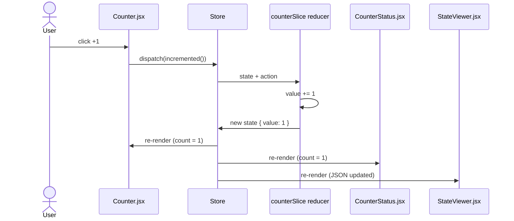

```text
button click → dispatch(incremented()) → counter reducer → new state → components re-render
```

### How files map to the diagram

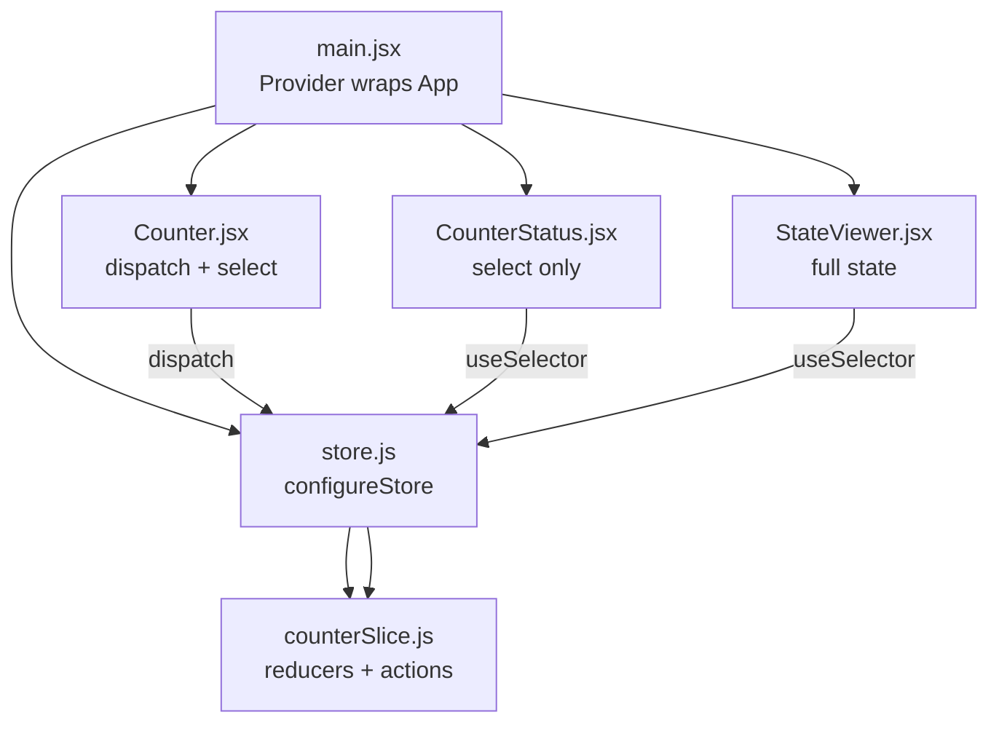

---

## Table of contents

- [How Redux works (visual overview)](#how-redux-works-visual-overview)
0. [Demo app](#demo-app)
1. [The problem Redux solves](#the-problem-redux-solves)
2. [Three core principles](#three-core-principles)
3. [Core concepts](#core-concepts)
4. [How data flows](#how-data-flows)
5. [Redux Toolkit (modern Redux)](#redux-toolkit-modern-redux)
6. [Async logic and side effects](#async-logic-and-side-effects)
7. [React integration](#react-integration)
8. [Middleware](#middleware)
9. [Selectors and derived state](#selectors-and-derived-state)
10. [DevTools](#devtools)
11. [When to use Redux](#when-to-use-redux)
12. [Further reading](#further-reading)

---

## The problem Redux solves

As a React app grows, state often ends up scattered:

- Local `useState` in many components
- Props passed through layers of components that do not need them (prop drilling)
- Sibling components that need the same data but have no shared parent
- Update logic duplicated or hidden in event handlers
- Hard-to-reproduce bugs when multiple places mutate the same object

Redux addresses this by keeping **all important application state in one place** (the store) and requiring **all updates to follow one strict path** (dispatch an action → reducer returns new state). That makes changes easier to trace, test, and reason about — especially in larger teams and codebases.

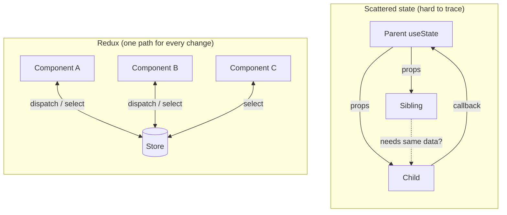

Redux is for **client/UI state**: auth session flags, UI toggles, shopping cart contents, wizard step, filters, and similar data that lives in the browser. For **server state** (API data, caching, refetching), tools like [TanStack Query](https://tanstack.com/query) or [RTK Query](https://redux-toolkit.js.org/rtk-query/overview) are usually a better fit. Many production apps use Redux for client state and a server-state library for API data.

---

## Three core principles

Redux is built on three rules. Understanding them is the key to understanding everything else.

### 1. Single source of truth

The entire application state is stored in **one object tree** inside a single **store**. Any component can read from it; you do not maintain parallel copies of “the cart” or “the current user” in different branches of the tree.

### 2. State is read-only

The only way to change state is to **dispatch an action** — a plain object describing *what happened*, not *how to change things*. You never call `store.state.cart.push(item)` or mutate nested objects in place.

### 3. Changes are made with pure functions

**Reducers** are pure functions: `(previousState, action) => newState`. Given the same inputs, they always return the same output. They do not perform side effects (no API calls, no `Date.now()`, no random values). Side effects belong elsewhere (thunks, listeners, or your UI layer).

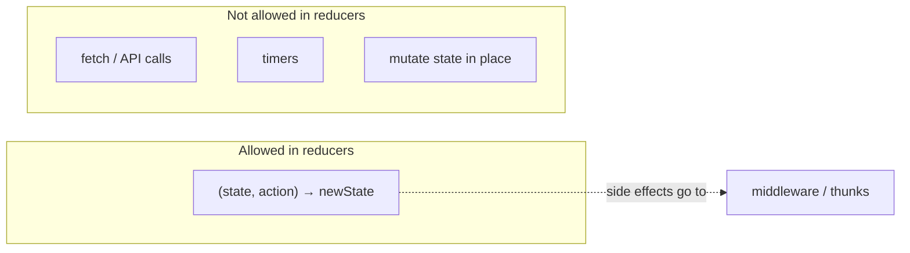

---

## Core concepts

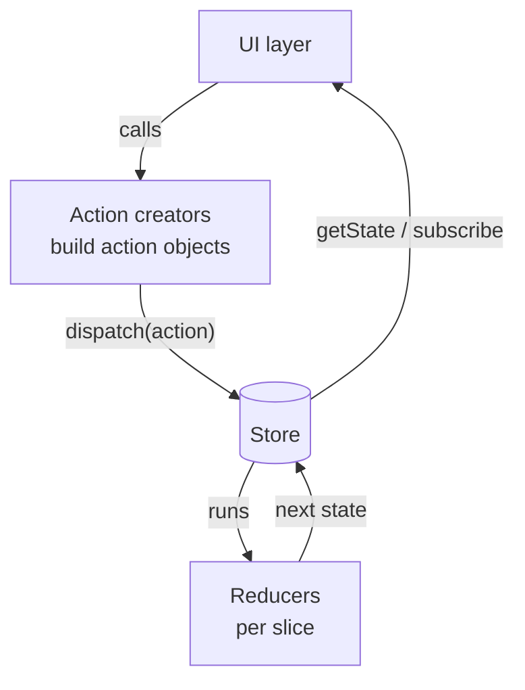


### Store

The **store** holds the current state tree and exposes three methods:

| Method | Purpose |
|--------|---------|
| `getState()` | Returns the current state |
| `dispatch(action)` | Sends an action to the reducer(s) and updates state |
| `subscribe(listener)` | Registers a callback that runs after each dispatch |

You typically create one store for the whole app (or one per page in advanced setups). Components read from the store and dispatch actions when something happens.

### Actions

An **action** is a plain JavaScript object with at least a `type` field (usually a string constant). It describes an event: “user added item”, “login succeeded”, “theme toggled”.

```js
// Action type constants keep reducers and dispatchers in sync
const ADD_TODO = 'todos/add'

// Action object
const action = {
  type: ADD_TODO,
  payload: { id: 1, text: 'Learn Redux', done: false },
}
```

The `type` is required. Extra fields (`payload`, `meta`, `error`) are conventions — Redux does not interpret them; your reducers do.

**Action creators** are functions that return action objects (and keep dispatch sites tidy):

```js
function addTodo(text) {
  return {
    type: ADD_TODO,
    payload: { id: Date.now(), text, done: false },
  }
}

store.dispatch(addTodo('Learn Redux'))
```

### Reducers

A **reducer** specifies how state changes in response to an action. It receives the previous state and an action, and returns the **next** state.

```js
const initialState = { items: [], filter: 'all' }

function todosReducer(state = initialState, action) {
  switch (action.type) {
    case ADD_TODO:
      return {
        ...state,
        items: [...state.items, action.payload],
      }
    case 'todos/setFilter':
      return { ...state, filter: action.payload }
    default:
      return state
  }
}
```

Important details:

- **Never mutate** `state`. Return a new object (or use Immer inside Redux Toolkit, which lets you write “mutating” syntax that produces immutable updates).
- **Always return state** for unknown actions (`default` branch) so combined reducers stay composable.
- Reducers must be **pure**: no fetching, no timers, no reading from `localStorage` inside the reducer.

### Root reducer and `combineReducers`

Large apps split state by **slice** (domain). Each slice has its own reducer. `combineReducers` merges them into one state tree:

```js
import { combineReducers } from 'redux'

const rootReducer = combineReducers({
  todos: todosReducer,
  user: userReducer,
  ui: uiReducer,
})

// State shape:
// {
//   todos: { items: [], filter: 'all' },
//   user: { name: null, loggedIn: false },
//   ui: { sidebarOpen: true },
// }
```

Each reducer only sees **its slice** of state as `state` and only returns updates for that slice.

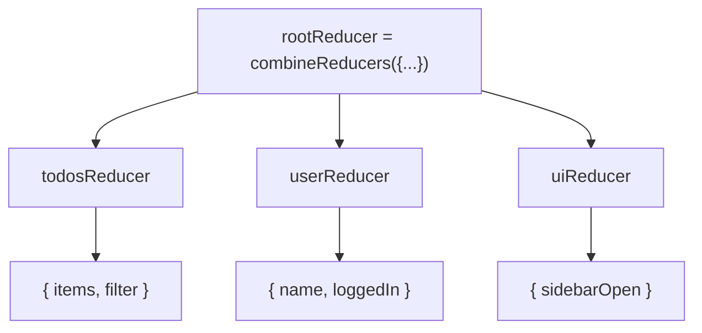

---

## How data flows

Redux uses **strictly unidirectional** data flow. The same sequence runs for every update:

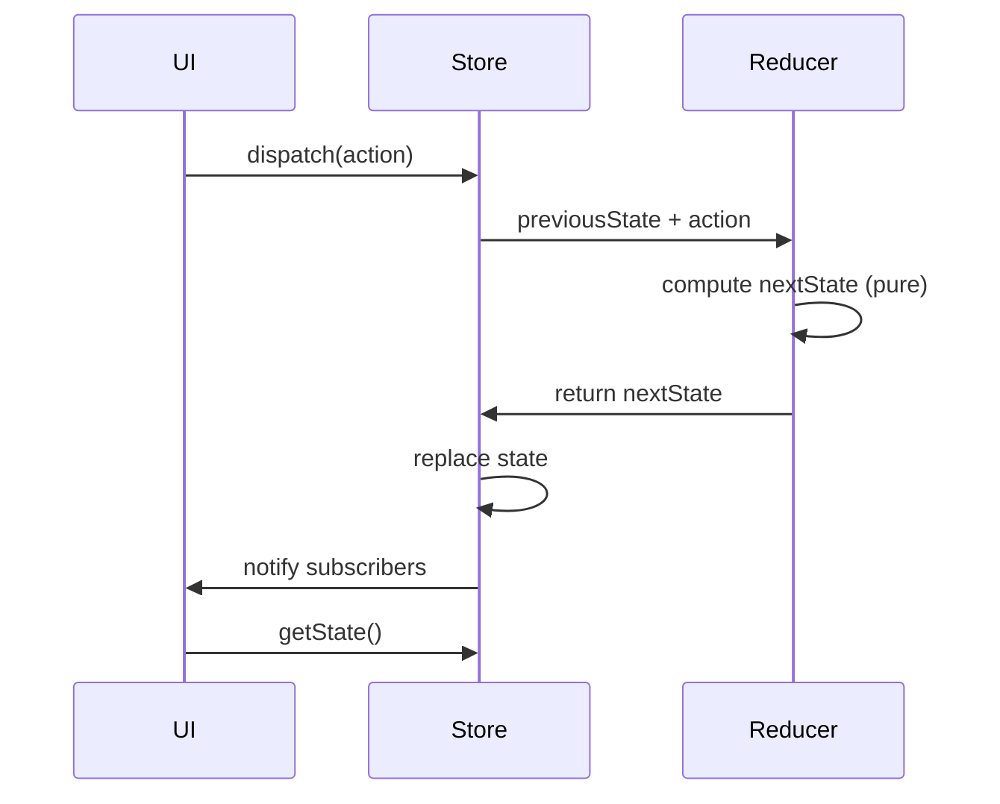

In words:

1. Something happens in the UI (click, form submit, websocket message handled in middleware).
2. The UI **dispatches an action**.
3. The store calls the root reducer with the current state and the action.
4. The reducer returns new state (immutable update).
5. The store saves the new state and **notifies subscribers**.
6. Subscribed views (e.g. React components via `react-redux`) re-read state and re-render.

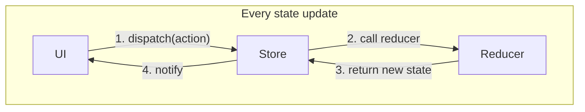

Because there is only one path for updates, you can log every action and state transition, replay them, or write tests that dispatch actions and assert on `getState()` — without mounting a full UI.

---

## Redux Toolkit (modern Redux)

[Redux Toolkit](https://redux-toolkit.js.org/) (`@reduxjs/toolkit`) is the official, recommended way to write Redux. It includes:

- `configureStore` — store setup with good defaults (including Redux DevTools)
- `createSlice` — defines actions + reducer together
- `createAsyncThunk` — standard pattern for async actions
- Immer built in — write “mutable” logic that produces immutable state
- RTK Query — optional data fetching and caching layer

### `configureStore`

```js
import { configureStore } from '@reduxjs/toolkit'
import todosReducer from './todosSlice'

export const store = configureStore({
  reducer: {
    todos: todosReducer,
  },
})
```

`configureStore` wires up the root reducer, enables DevTools in development, and adds default middleware (including support for thunks).

### `createSlice`

A **slice** is one piece of state plus its reducers and auto-generated action creators:

```js
import { createSlice } from '@reduxjs/toolkit'

const todosSlice = createSlice({
  name: 'todos',
  initialState: { items: [], filter: 'all' },
  reducers: {
    added(state, action) {
      // Immer: "mutating" state is safe here
      state.items.push(action.payload)
    },
    setFilter(state, action) {
      state.filter = action.payload
    },
  },
})

export const { added, setFilter } = todosSlice.actions
export default todosSlice.reducer
```

`createSlice` generates action types like `todos/added` from `name` + reducer key. You export the action creators and the reducer as the slice’s default export.

### Typing (TypeScript)

With TypeScript, infer types from the store:

```ts
export type RootState = ReturnType<typeof store.getState>
export type AppDispatch = typeof store.dispatch
```

Use typed hooks (`useAppSelector`, `useAppDispatch`) in React so selectors and dispatches stay type-safe.

---

## Async logic and side effects

Reducers must stay pure, so **async work does not belong in reducers**. Common patterns:

### `createAsyncThunk`

Dispatches pending / fulfilled / rejected actions around a promise:

```js
import { createAsyncThunk, createSlice } from '@reduxjs/toolkit'

export const fetchUser = createAsyncThunk('user/fetch', async (userId) => {
  const response = await fetch(`/api/users/${userId}`)
  return response.json()
})

const userSlice = createSlice({
  name: 'user',
  initialState: { data: null, status: 'idle', error: null },
  reducers: {},
  extraReducers(builder) {
    builder
      .addCase(fetchUser.pending, (state) => {
        state.status = 'loading'
      })
      .addCase(fetchUser.fulfilled, (state, action) => {
        state.status = 'succeeded'
        state.data = action.payload
      })
      .addCase(fetchUser.rejected, (state, action) => {
        state.status = 'failed'
        state.error = action.error.message
      })
  },
})
```

Dispatch from a component: `dispatch(fetchUser(42))`.

### RTK Query

For API-heavy apps already on Redux Toolkit, **RTK Query** provides caching, deduplication, background refetch, and hooks like `useGetUserQuery(42)` so you write less boilerplate than hand-rolled thunks for every endpoint.

### Listeners and other middleware

`createListenerMiddleware` can react to actions (e.g. “on logout, clear cache”). Custom middleware can log, analytics, or bridge websockets — as long as it eventually calls `dispatch` with plain actions for state changes.

---

## React integration

The **`react-redux`** package connects Redux to React.

### Provider

Wrap the app (or subtree) so any descendant can access the store:

```jsx
import { Provider } from 'react-redux'
import { store } from './store'

<Provider store={store}>
  <App />
</Provider>
```

### `useSelector`

Reads a piece of state from the store. The component re-renders when that piece changes (shallow compare by default):

```jsx
import { useSelector } from 'react-redux'

function TodoList() {
  const items = useSelector((state) => state.todos.items)
  const filter = useSelector((state) => state.todos.filter)
  // ...
}
```

Pass a stable selector or use `useMemo` for expensive derived data; avoid creating new objects in the selector on every call unless memoized (see [reselect](#selectors-and-derived-state)).

### `useDispatch`

Returns the store’s `dispatch` function:

```jsx
import { useDispatch } from 'react-redux'
import { added } from './todosSlice'

function AddTodoForm() {
  const dispatch = useDispatch()

  function handleSubmit(e) {
    e.preventDefault()
    dispatch(added({ id: crypto.randomUUID(), text: 'New todo', done: false }))
  }
  // ...
}
```

### Mental model

React components are **views**: they read state with `useSelector` and **report events** with `dispatch`. They should not own the canonical copy of global state; the store does.

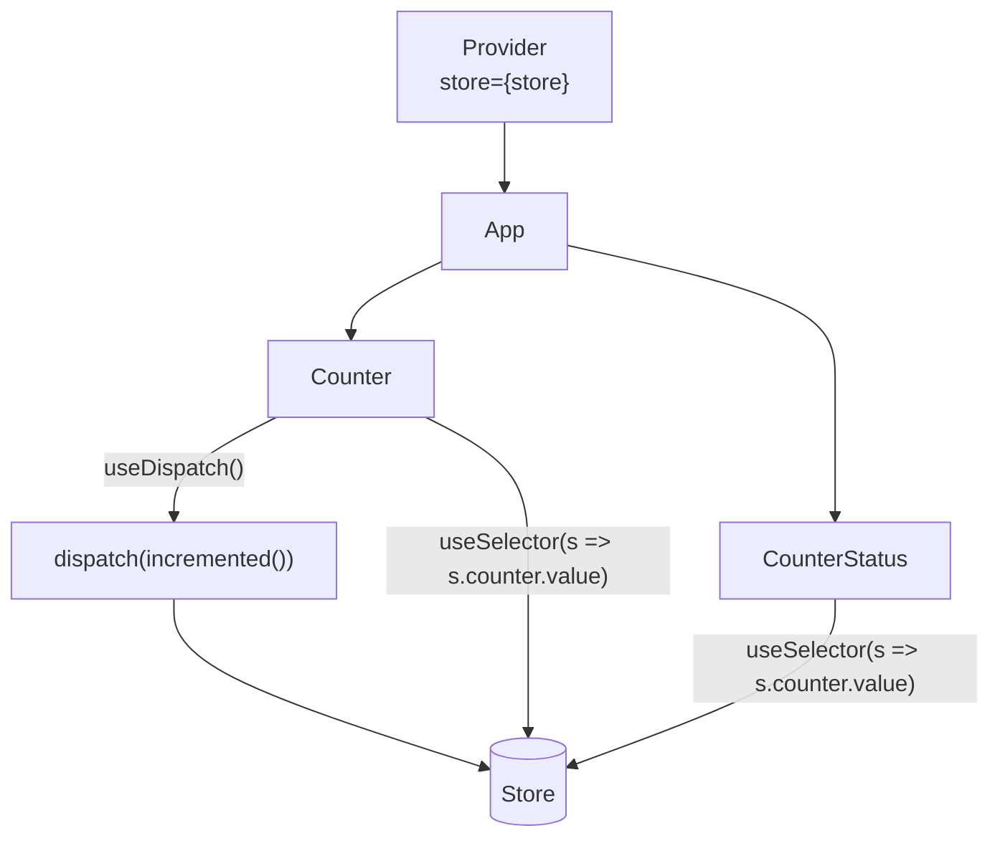

| Hook | Direction | Role |
|------|-----------|------|
| `useSelector` | Store → component | Read state; re-render when selected data changes |
| `useDispatch` | Component → store | Send actions |
| `Provider` | Wraps tree | Makes the store available to all descendants |

---

## Middleware

**Middleware** extends `dispatch` with a chain of functions. Each middleware can inspect an action, pass it on, modify it, delay it, or dispatch other actions.

```js
// Conceptual signature
(store) => (next) => (action) => { /* ... */ next(action) }
```

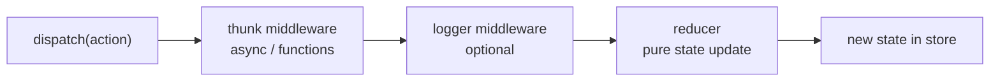

An async thunk might dispatch several plain actions over time:

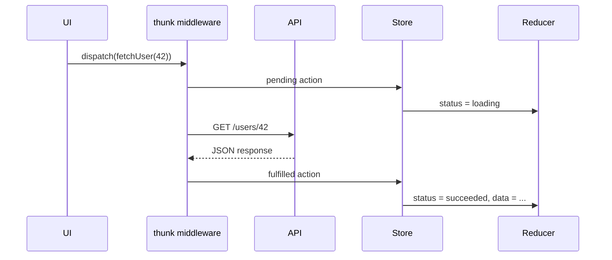

Common uses:

| Middleware / pattern | Role |
|---------------------|------|
| `redux-thunk` | Allows `dispatch(function)` for async logic (included in RTK by default) |
| `redux-logger` | Logs actions and state diffs in development |
| Custom | Auth tokens, analytics, crash reporting |

Redux Toolkit’s `configureStore` adds thunk middleware automatically. You can append custom middleware in the `middleware` option.

---

## Selectors and derived state

A **selector** is a function `(state) => sliceOrDerivedValue`. Simple selectors read from the tree; **memoized selectors** (e.g. via [reselect](https://github.com/reduxjs/reselect), re-exported from RTK) cache results until inputs change — useful for filtered lists, totals, or sorting:

```js
import { createSelector } from '@reduxjs/toolkit'

const selectItems = (state) => state.todos.items
const selectFilter = (state) => state.todos.filter

export const selectVisibleTodos = createSelector(
  [selectItems, selectFilter],
  (items, filter) => {
    if (filter === 'active') return items.filter((t) => !t.done)
    if (filter === 'completed') return items.filter((t) => t.done)
    return items
  }
)
```

Keep **derived data out of the store** when it can be computed from existing state. Store minimal facts; select derived views in components or selectors.

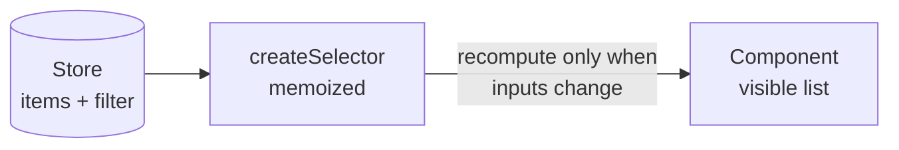

---

## DevTools

The [Redux DevTools Extension](https://github.com/reduxjs/redux-devtools) records every action and state diff, supports time-travel debugging (jump to any past state), and can import/export action sequences for reproducing bugs.

`configureStore` enables DevTools integration in development without extra setup. This is one of Redux’s main advantages for team debugging compared to ad hoc global variables or scattered context.

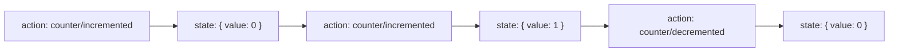

Each row in DevTools is one trip through the dispatch → reducer → store loop. You can jump back to any prior state to reproduce a bug.

---

## When to use Redux

**Good fits**

- Many components need the same client state
- State update rules are non-trivial or shared across features
- You want predictable updates, strong conventions, and excellent debugging
- Large or long-lived codebase with many contributors

**Often unnecessary**

- Small apps where `useState` and `useContext` are enough
- Mostly server-driven data — prefer TanStack Query or RTK Query
- Simple global flags — [Zustand](https://zustand.docs.pmnd.rs/) or context may be simpler

A practical progression (also noted in `ReactJs/state_management.md` in this repo):

1. Local state (`useState`)
2. Shared subtree (`useContext` + optional `useReducer`)
3. Simple global client state (Zustand)
4. Large structured apps (Redux Toolkit + optional RTK Query for APIs)

---

## Further reading

| Resource | Description |
|----------|-------------|
| [Redux docs](https://redux.js.org/) | Core concepts and API |
| [Redux Toolkit docs](https://redux-toolkit.js.org/) | Recommended tooling and patterns |
| [React Redux docs](https://react-redux.js.org/) | Hooks, Provider, performance |
| [Redux Style Guide](https://redux.js.org/style-guide/style-guide) | Official best practices |
| [RTK Query overview](https://redux-toolkit.js.org/rtk-query/overview) | Server state with Redux |

### Minimal dependencies for a React + RTK app

```bash
npm install @reduxjs/toolkit react-redux
```

`@reduxjs/toolkit` includes Redux core, Immer, redux-thunk, and reselect — you usually do not install `redux` separately.

---

## Summary

| Piece | Role |
|-------|------|
| **Store** | Single source of truth; holds state, runs reducers on dispatch |
| **Action** | Plain object describing what happened (`type` + optional `payload`) |
| **Reducer** | Pure function `(state, action) => newState` |
| **Dispatch** | Only way to trigger a state update |
| **Selector** | Reads (and optionally derives) state for the UI |
| **Middleware / thunk** | Side effects and async work outside reducers |
| **React Redux** | `Provider`, `useSelector`, `useDispatch` bridge to React |

Redux’s strength is not brevity — it is **predictability**: one state tree, one update path, pure reducers, and tooling that makes every transition visible. Redux Toolkit removes most historical boilerplate while keeping that model intact.

---
# Thunk

A **thunk** is a function that wraps work you want to do later. In Redux, it usually means: **instead of dispatching a plain action object, you dispatch a function** — and middleware runs that function so you can do async or side-effectful work.

## Plain Redux vs thunk

Normally Redux only accepts actions like:

```js
dispatch({ type: 'counter/incremented' })
```

A **thunk** lets you do:

```js
dispatch((dispatch, getState) => {
  // async work, API calls, timers, etc.
  dispatch({ type: 'user/fetchStarted' })
  fetch('/api/user')
    .then(res => res.json())
    .then(data => dispatch({ type: 'user/fetchSucceeded', payload: data }))
})
```

You dispatch a **function**, not an object. The **redux-thunk** middleware intercepts it, calls the function, and passes in `dispatch` and `getState`.

## Why it exists

Reducers must be **pure** and **synchronous** — no `fetch`, no `setTimeout`, no reading `localStorage`. But real apps need those things.

Thunks are the standard place for:

- API calls
- waiting on promises
- dispatching multiple actions over time (loading → success → error)

Your README puts it this way: side effects go to **middleware / thunks**, not reducers.

## `redux-thunk` vs `createAsyncThunk`

| | **redux-thunk** | **createAsyncThunk** (RTK) |
|---|---|---|
| What it is | Middleware that allows `dispatch(function)` | Helper that builds a thunk for you |
| Boilerplate | You write pending/success/error actions yourself | RTK generates `pending` / `fulfilled` / `rejected` |
| In your project | Included automatically via `configureStore` | Available from `@reduxjs/toolkit` |

Example with RTK:

```js
export const fetchUser = createAsyncThunk('user/fetch', async (userId) => {
  const response = await fetch(`/api/users/${userId}`)
  return response.json()
})

// In a component:
dispatch(fetchUser(42))
```

Under the hood that’s still a thunk — RTK just saves you from writing the loading/success/error wiring by hand.

## In your demo app

Your counter demo **does not use thunks**. It only dispatches sync actions like `incremented()` from `counterSlice.js`. That’s fine for a simple demo.

`configureStore` in `store.js` still enables thunk middleware by default (via `@reduxjs/toolkit` → `redux-thunk`), so you can add async logic later without extra setup.

## Name origin

“Thunk” comes from compiler terminology: a **thunk** is a stub/delayed computation — “call this later.” In Redux: “don’t update state now; run this function first, then dispatch real actions when ready.”

**Short version:** a thunk is a **function you dispatch** so Redux can handle **async and side effects** outside reducers.