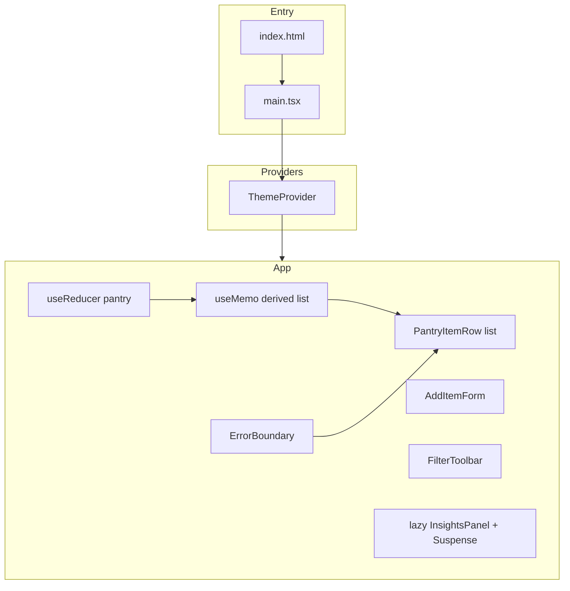

# Shelf Life

A small **pantry / best-by tracker** built as a React 19 + TypeScript showcase. It demonstrates hooks, context, `useReducer`, code splitting, an error boundary, and browser persistence without a backend.

## Requirements

- **Node.js** 20+ recommended (matches current Vite / ESLint tooling)
- **npm** 10+ (or another client that respects `package-lock.json`)

## Install, build, and run

From this directory (`projects/shelf-life`):

```bash
npm install
```

| Command | Purpose |
|--------|---------|
| `npm run dev` | Start the Vite dev server with HMR. Default URL is printed in the terminal (usually `http://localhost:5173`). |
| `npm run build` | Run `tsc -b` (TypeScript project references), then `vite build`. Output goes to `dist/`. |
| `npm run preview` | Serve the production build locally to verify `dist/` before deploy. |
| `npm run lint` | Run ESLint on the repo (flat config in `eslint.config.js`). |

**Typical workflow:** `npm install` once, then `npm run dev` while developing. Before a release, run `npm run build` and optionally `npm run preview`.

There is no `.env` file in this sample; all configuration is code and standard Vite/TS settings (see [App configuration](#app-configuration)).

## App user guide

Shelf Life helps you track pantry items and their **best-by dates** in the browser. Nothing is sent to a server; your list and preferences stay on this device (see [Client-side persistence](#client-side-persistence)).

### First visit

On a fresh browser profile (or after clearing storage), the app loads a few **sample items** so you can explore filters and sorting immediately. Your changes replace that data as soon as you add, edit, or remove items and the app saves.

### Add an item

1. In **Add item**, enter a **name** (required).
2. Choose a **category**: produce, dairy, pantry, or frozen.
3. Set **Best-by date** with the date picker.
4. Click **Add to shelf**. The new row appears at the top of the list, and the name field is focused again for quick entry.

### Your shelf (list)

Each row shows:

- **Status control** (circle / check): tap to mark an item as **used** or not used. Used rows look faded but stay in the list until you remove them.
- **Name**, **category** tag, and **Best by** date.
- **Urgency pill** (computed from today’s date and the best-by date):
  - **On track** — more than three days before the best-by date.
  - **Use soon** — best-by date is **today or within the next three days**.
  - **Past date** — best-by date is **before today**.

Use **Remove** to delete a row permanently.

Above the list, the **summary** counts **active** items (not marked used), plus how many are **use soon** or **overdue** (past date).

### Filter and sort

- **Filter** chips restrict the list to one category or **all**.
- **Sort** switches between **By date** (earliest best-by first) and **By name** (A–Z).

If nothing matches the current filter, you’ll see a short empty message—widen the filter or add an item.

### Theme

Use **Dark theme** / **Light theme** in the header to switch palettes. The choice is remembered for this browser.

### Insights chart

Open **Insights**, then click **Show chart**. A simple bar view compares how many **active** (not used) items you have in each category. Click **Hide chart** to collapse it and avoid loading that panel until you need it again.

### If something breaks in the list

The shelf area is wrapped in an error boundary. If a render error occurs there, you’ll see a short message and **Try again** instead of losing the whole page.

## App architecture

### High-level shape

- **Entry:** `index.html` mounts `#root` and loads `src/main.tsx`.
- **Shell:** `main.tsx` wraps the tree in `StrictMode` and `ThemeProvider`, then renders `App`.
- **State:** Pantry items, filters, and sort order live in a single **`useReducer`** slice (`pantryReducer` + `getInitialPantryState`). The UI derives filtered/sorted rows with **`useMemo`**.
- **Theme:** `ThemeProvider` owns light/dark state and writes `data-theme` on `document.documentElement` so CSS tokens can switch.
- **Code splitting:** `InsightsPanel` is loaded with **`React.lazy`** and **`Suspense`** so it can ship in a separate chunk until the user opens “Insights”.
- **Resilience:** The pantry list is wrapped in an **`ErrorBoundary`** class component so a subtree error does not tear down the whole app.



### Source layout

| Path | Role |
|------|------|
| `src/main.tsx` | `createRoot`, `StrictMode`, `ThemeProvider` |
| `src/App.tsx` | Reducer, persistence effect, layout, lazy insights |
| `src/types.ts` | Domain types (`PantryItem`, categories, sort keys) |
| `src/pantryReducer.ts` | Reducer, `localStorage` hydrate/persist, seed data |
| `src/context/themeContext.ts` | `createContext` + types |
| `src/context/ThemeProvider.tsx` | Theme state and DOM sync |
| `src/context/useTheme.ts` | Consumer hook |
| `src/components/AddItemForm.tsx` | Controlled form, `useId`, `useRef` |
| `src/components/FilterToolbar.tsx` | Controlled filter/sort controls |
| `src/components/PantryItemRow.tsx` | `memo` row + callbacks from parent |
| `src/components/ErrorBoundary.tsx` | Class-based error boundary |
| `src/InsightsPanel.tsx` | Default export for `React.lazy` |
| `src/index.css` | Global styles and `[data-theme]` tokens |

### Client-side persistence

The app reads and writes browser **`localStorage`** (no server):

- **`shelf-life-pantry-v1`** — full pantry state: `items`, `filterCategory`, `sortKey` (see `src/pantryReducer.ts`).
- **`shelf-life-theme`** — `"light"` or `"dark"` (see `src/context/ThemeProvider.tsx`).

Clearing those keys resets pantry data to seeded defaults and theme to light on next load (until toggled again).

## App configuration

### Vite (`vite.config.ts`)

- Uses **`@vitejs/plugin-react`** for Fast Refresh and JSX transform.
- No custom `server`, `build`, or `resolve` overrides; defaults apply (e.g. dev port 5173, `dist` output).

To change dev server port or proxy APIs, extend `defineConfig` in this file per the [Vite config reference](https://vite.dev/config/).

### TypeScript

- **`tsconfig.json`** — solution-style root: references `tsconfig.app.json` and `tsconfig.node.json`, no files compiled at root.
- **`tsconfig.app.json`** — application code under `src/`: `strict`, `jsx: "react-jsx"`, `moduleResolution: "bundler"`, `verbatimModuleSyntax`, `noEmit` (Vite bundles; `tsc` type-checks only).
- **`tsconfig.node.json`** — tooling config (`vite.config.ts`) with Node-oriented `lib` / `types`.

The **`npm run build`** script runs **`tsc -b`** first so both referenced projects type-check before `vite build`.

### ESLint (`eslint.config.js`)

Flat config with:

- `@eslint/js` recommended
- `typescript-eslint` recommended
- `eslint-plugin-react-hooks` recommended
- `eslint-plugin-react-refresh` Vite preset (e.g. fast-refresh export rules)

Browser globals come from **`globals.browser`**. **`dist/`** is ignored.

### HTML shell (`index.html`)

Sets page metadata, favicon, viewport, and the document title. The JS entry is **`/src/main.tsx`** (Vite resolves and bundles it).

---

For a tour of React patterns used in the UI, start with the comment block at the top of `src/App.tsx` and follow imports into `src/components/` and `src/context/`.
